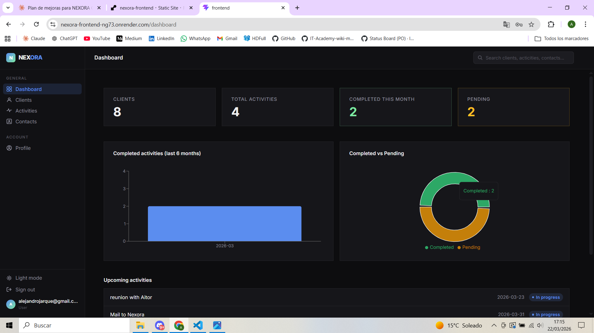
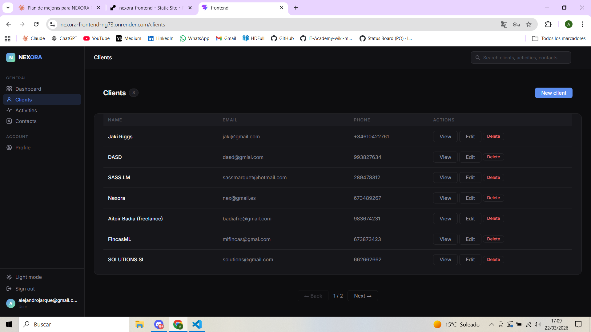
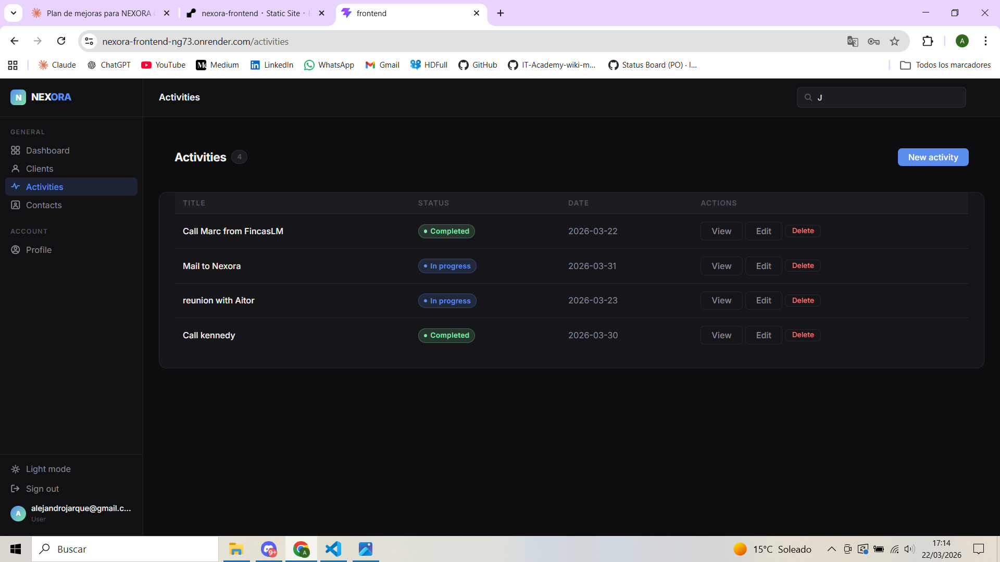
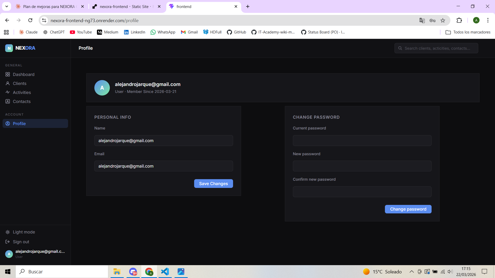
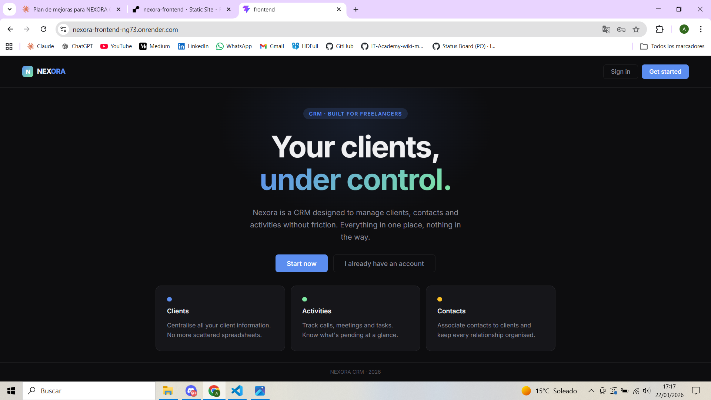
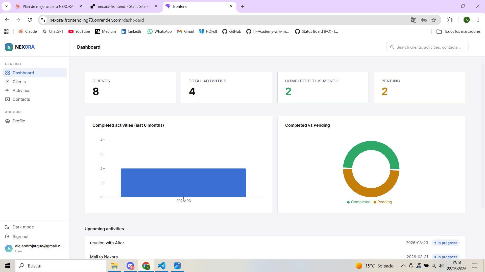

# NEXORA CRM

A fullstack CRM (Customer Relationship Management) application built with Laravel and React. Designed to help teams manage clients, contacts, activities, and track business relationships in a clean and efficient way.



## Live Demo

| Service | URL |
|---------|-----|
| Frontend | https://nexora-frontend-ng73.onrender.com |
| Backend API | https://crm-nexora.onrender.com |
| API Docs | https://crm-nexora.onrender.com/swagger/index.html |

## Features

- **Dashboard** — Key metrics at a glance: clients, activities, completed vs pending ratio, monthly chart and recent activity feed
- **Clients** — Full CRUD with search and pagination
- **Contacts** — Manage contacts associated to clients, with position, email and phone
- **Activities** — Track tasks and interactions with clients, with status and date filtering
- **Global Search** — Search across clients, contacts and activities from the topbar with debounced input and grouped results
- **Role-based access** — Admin users see all records; regular users see only their own
- **Light / Dark mode** — Theme toggle persisted across sessions
- **API Documentation** — Swagger UI available in production

## Screenshots







## Tech Stack

### Backend
| Technology | Purpose |
|------------|---------|
| Laravel 12 | PHP framework |
| PHP 8.2 | Runtime |
| Laravel Passport | OAuth2 authentication |
| PostgreSQL | Production database |
| MySQL 8.0 | Local development database |
| PHPUnit | Testing (TDD) |
| OpenAPI 3.0 | API documentation (Swagger UI) |

### Frontend
| Technology | Purpose |
|------------|---------|
| React 19 | UI framework |
| TypeScript | Type safety |
| Vite | Build tool |
| React Router DOM v7 | Client-side routing |
| Axios | HTTP client |
| Recharts | Data visualization |

### Infrastructure
| Technology | Purpose |
|------------|---------|
| Docker + Nginx | Local development environment |
| Render | Cloud deployment |
| Git & GitHub | Version control and Gitflow |

## Project Structure
```
nexora-crm/
├── backend/                      # Laravel API
│   ├── app/
│   │   ├── Application/          # Services and use cases
│   │   │   ├── Activities/
│   │   │   ├── Clients/
│   │   │   ├── Contacts/
│   │   │   └── Dashboard/
│   │   ├── Domain/               # Domain events
│   │   ├── Http/
│   │   │   ├── Controllers/
│   │   │   │   └── Api/
│   │   │   │       ├── Auth/
│   │   │   │       └── V1/
│   │   │   ├── Requests/
│   │   │   └── Resources/
│   │   └── Models/
│   ├── database/
│   │   ├── migrations/
│   │   └── seeders/
│   ├── public/
│   │   ├── openapi.yaml
│   │   └── swagger/
│   ├── routes/
│   │   └── api.php
│   └── tests/
│       └── Feature/
├── frontend/                     # React SPA
│   ├── src/
│   │   ├── api/                  # Axios API calls
│   │   ├── components/
│   │   │   ├── GlobalSearch/
│   │   │   └── layout/
│   │   ├── context/              # Auth and Theme context
│   │   ├── pages/
│   │   │   ├── activities/
│   │   │   ├── admin/
│   │   │   ├── auth/
│   │   │   ├── clients/
│   │   │   ├── contacts/
│   │   │   ├── dashboard/
│   │   │   ├── profile/
│   │   │   └── welcome/
│   │   └── router/
│   └── public/
└── docs/
    └── screenshots/
```

## Architecture

The application is structured around a layered architecture inspired by Domain-Driven Design (DDD):

### Controllers (HTTP Layer)

* Handle incoming HTTP requests
* Validate request intent and format
* Delegate business logic to the Application layer
* Return standardized JSON responses

### Application Layer

* Contains use cases and services
* Coordinates domain logic
* Acts as an intermediary between Controllers and Domain logic

### Domain Layer

* Represents the core business logic
* Contains domain events and entities
* Is independent of framework-specific details

### Infrastructure

* Database access via Eloquent ORM
* Authentication and authorization mechanisms
* Configuration and environment setup

## Authentication

Authentication is handled using token-based security suitable for REST APIs.

* OAuth2-based authentication using Laravel Passport
* Users authenticate via a login endpoint
* A valid access token is required to access protected endpoints
* Tokens are sent using the `Authorization: Bearer <token>` header

This approach ensures the API remains stateless and secure.

## Database Design

The database is intentionally simple and normalized. It consists of the following main entities:

* **Users**: Application users who authenticate and perform actions
* **Clients**: Customers managed by users
* **Contacts**: People associated with a client
* **Activities**: Actions or events associated with a client

Relationships:

* A User can have many Clients
* A Client belongs to a User
* A Client can have many Contacts
* A Contact belongs to a Client
* A Client can have many Activities
* An Activity belongs to both a Client and a User

Migrations and seeders are provided to simplify setup and local development.

## API Documentation

Swagger UI is available at:

* **Production**: https://crm-nexora.onrender.com/swagger/index.html
* **Local**: http://localhost:8080/swagger/index.html

The OpenAPI specification is located at `backend/public/openapi.yaml`.

## Local Development

### Prerequisites

* Docker Desktop
* Git

### With Docker (recommended)

1. Clone the repository
```bash
git clone https://github.com/AlejandroJarque/CRM_APIrest.git
cd CRM_APIrest
```

2. Copy environment file
```bash
cp backend/.env.docker backend/.env
```

3. Start containers
```bash
docker compose up -d
```

4. Run migrations and seeders
```bash
docker exec crm_app php artisan migrate --seed
```

5. Create Passport personal access client
```bash
docker exec crm_app php artisan passport:client --personal --no-interaction
```

Backend available at: `http://localhost:8080`  
Frontend available at: `http://localhost:5173`  
API Docs available at: `http://localhost:8080/swagger/index.html`

### Without Docker

#### Backend

1. Clone the repository
```bash
git clone https://github.com/AlejandroJarque/CRM_APIrest.git
cd CRM_APIrest/backend
```

2. Install PHP dependencies
```bash
composer install
```

3. Copy environment configuration and generate key
```bash
cp .env.example .env
php artisan key:generate
```

4. Configure database credentials in `.env`

5. Run migrations and seeders
```bash
php artisan migrate --seed
php artisan passport:client --personal --no-interaction
```

6. Start the development server
```bash
php artisan serve
```

#### Frontend

1. Install dependencies
```bash
cd frontend
npm install
```

2. Copy environment file
```bash
cp .env.development .env
```

3. Start the dev server
```bash
npm run dev
```

Frontend available at: `http://localhost:5173`

## Environment Variables

### Backend (.env)
```env
APP_ENV=local
APP_DEBUG=true
APP_URL=http://localhost:8080

DB_CONNECTION=mysql
DB_HOST=127.0.0.1
DB_PORT=3306
DB_DATABASE=crm
DB_USERNAME=your_username
DB_PASSWORD=your_password

FRONTEND_URL=http://localhost:5173
```

### Frontend (.env.development)
```env
VITE_API_URL=http://localhost:8080/api
```

## Deployment

The application is deployed on [Render](https://render.com):

* **Backend** — Web Service running a Docker container. On every deploy: migrations run automatically, Passport keys are generated, and the application cache is cleared.
* **Frontend** — Static Site. Built with `npm run build` and served as a static bundle.

### Production environment variables

#### Backend
```env
APP_ENV=production
APP_DEBUG=false
APP_URL=https://crm-nexora.onrender.com
DB_CONNECTION=pgsql
FRONTEND_URL=https://nexora-frontend-ng73.onrender.com
```

#### Frontend
```env
VITE_API_URL=/api
```

## Running Tests
```bash
docker exec crm_app php artisan test
```

Current test suite: **101 tests, 238 assertions**.

## Git Workflow

This project follows **Gitflow**:

* `main` — production-ready code, tagged releases
* `develop` — integration branch
* `feature/*` — new features
* `fix/*` — bug fixes
* `release/*` — release preparation

All commits follow conventional prefixes: `feat:`, `fix:`, `docs:`, `refactor:`, `test:`.

## Development Notes

* Controllers are kept thin and focused on HTTP concerns
* Business logic is encapsulated in service classes
* Domain events decouple side effects from core logic
* The codebase follows Laravel and REST best practices
* The project is designed to be easily extendable

## Mailing and Events

The project includes support for domain events and notifications:

* Domain events are triggered on relevant actions (e.g. client creation, activity registration)
* The structure allows easy extension for email notifications or asynchronous processing
* The system is ready to be integrated with external mailing services if required


